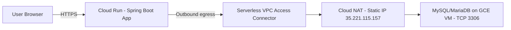

# 🍕 DeliveryByMotta — Pizza & Pasta Web Ordering System

> **EN**: A Spring Boot. + Thymeleaf web application for a pizza & pasta restaurant chain.  
> **JP**: ピザ＆パスタのレストランチェーン向けに作成した Spring Boot + Thymeleaf の Web アプリです。

---

## ✨ Highlights / 特長

- 🏬 **Multi-shop**: shop selection & per-shop menus. / 店舗選択と店舗別メニュー  
- 🧾 **Orders & cart**: add/remove items, confirm, persist / カート追加・削除、注文確定  
- 👤 **Customer**: login, registration, password reset flow / ログイン、会員登録、パスワード再設定  
- 🌐 **i18n-ready** UI (EN/JP) / 多言語化対応  
- ☁️ **Cloud Run** + **VPC Connector** + **Cloud NAT** (fixed egress IP) / 固定送信元IPでの安全な DB 接続

---

## 🏗 Architecture / アーキテクチャ



- **Frontend**: Thymeleaf templates (SSR), HTML/CSS/JS  
- **Backend**: Spring Boot (MVC, Validation), Spring Data JDBC  
- **DB**: MySQL/MariaDB on a Google Cloud VM  
- **Networking**: Cloud Run → VPC Connector → Cloud NAT → DB (allow-list the NAT IP)

---

## 📂 Repository Structure / リポジトリ構成

```
src/
 ├─ main/
 │   ├─ java/jp/kenschool/delivery/
 │   │   ├─ DeliveryByMottaApplication.java
 │   │   ├─ ServletInitializer.java
 │   │   ├─ controller/
 │   │   │   ├─ IndexController.java
 │   │   │   ├─ MenuController.java
 │   │   │   ├─ ShopController.java
 │   │   │   ├─ CustomerController.java
 │   │   │   └─ OrderController.java
 │   │   ├─ dao/
 │   │   │   ├─ CustomerDAO.java
 │   │   │   ├─ MenuDAO.java
 │   │   │   └─ ShopDAO.java
 │   │   ├─ model/
 │   │   │   ├─ CartItemModel.java
 │   │   │   ├─ CustomerModel.java
 │   │   │   ├─ LoginInput.java
 │   │   │   ├─ LoginModel.java
 │   │   │   ├─ MenuCategoryModel.java
 │   │   │   ├─ MenuModel.java
 │   │   │   ├─ QandAModel.java
 │   │   │   ├─ ShopModel.java
 │   │   │   └─ ShoppingCart.java
 │   │   └─ utils/
 │   │       └─ TemplateUtilities.java
 │   └─ resources/
 │       ├─ static/
 │       │   ├─ css/common.css
 │       │   └─ js/shop_map.js
 │       ├─ templates/
 │       │   ├─ forgetPassword.html
 │       │   ├─ footer.html
 │       │   ├─ header.html
 │       │   ├─ index.html
 │       │   ├─ login.html
 │       │   ├─ menu.html
 │       │   ├─ order.html
 │       │   ├─ regist.html
 │       │   ├─ shop.html
 │       │   ├─ showNewPassword.html
 │       │   └─ updateCustomer.html
 │       └─ application.properties
 └─ test/  (optional tests)
pom.xml
```

---

## 🧰 Tech Stack / 技術スタック

- **Java 17**, **Spring Boot 3.x**, Spring MVC, Validation, Spring Data JDBC  
- **Thymeleaf**, HTML/CSS/JS  
- **MySQL / MariaDB** (Google Compute Engine VM)  
- **Maven Wrapper (`mvnw`)**, Google **Buildpacks**  
- **Google Cloud**: Cloud Run, Cloud Build (CI), Serverless VPC Access, Cloud NAT

---

## 🔧 Local Development / ローカル実行

**EN**
```bash
# Build
mvnw -DskipTests package

# Run
java -jar target/deliveryByMotta-0.0.1-SNAPSHOT.jar
# or
mvnw spring-boot:run
```

Set DB via env vars or `application.properties`:
```
spring.datasource.url=jdbc:mysql://<DB_HOST>:3306/delivery
spring.datasource.username=<USER>
spring.datasource.password=<PASS>
```

**JP**
```bash
# ビルド
mvnw -DskipTests package

# 起動
java -jar target/deliveryByMotta-0.0.1-SNAPSHOT.jar
# もしくは
mvnw spring-boot:run
```
DB 接続情報は環境変数または `application.properties` で設定。

---

## ☁️ Deployment (Cloud Run) / デプロイ

**EN**
1. Push to GitHub → Cloud Build (Buildpacks/Java)  
2. Cloud Run service (region: `asia-northeast1`)  
3. **Networking**: attach **VPC Connector**, set egress = **Route all traffic**  
4. Allow NAT IP on the MySQL VM (firewall + MySQL user host)  

**Env vars on Cloud Run**
```
DB_URL=jdbc:mysql://<VM_EXTERNAL_IP>:3306/delivery?useSSL=false&serverTimezone=Asia/Tokyo
DB_USER=motta
DB_PASS=********
GOOGLE_RUNTIME_VERSION=17
```

**JP**
1. GitHub へ push → Cloud Build が自動ビルド  
2. Cloud Run サービスを作成（リージョン `asia-northeast1`）  
3. **VPC コネクタ**を接続し、**すべてのトラフィックを VPC にルーティング**  
4. Cloud NAT の外部 IP を MySQL 側（FW とユーザーの host）に許可  

**Cloud Run 環境変数**
（上記と同様）

---

## 🔒 Security Notes / セキュリティ

- DB 接続は **Cloud Run → VPC Connector → Cloud NAT** 経由で固定送信元 IP を使用  
- MySQL ユーザーは **特定 IP（NAT IP）** のみ許可  
- 機密情報は **Secret Manager** に格納して参照する運用を推奨

---

## 📈 What this project demonstrates / 本プロジェクトで示すスキル

- Spring Boot MVC 設計、Thymeleaf を用いた SSR  
- 入力バリデーション、セッション/カート管理  
- RDB 設計と JDBC 連携、クラウド上の DB への安全な接続  
- CI/CD（Cloud Build）とサーバーレス運用（Cloud Run）

---

## 👤 Author / 作者

**Jaime Alberto Corredor Motta**  
- Sapporo, Japan — Open to **Java backend / full-stack** roles  
- GitHub: https://github.com/Itmanco
- Linkedin: https://www.linkedin.com/in/jmottadev/

---

### License
This project is for demonstration/portfolio purposes. Add a license if you plan to open-source.
